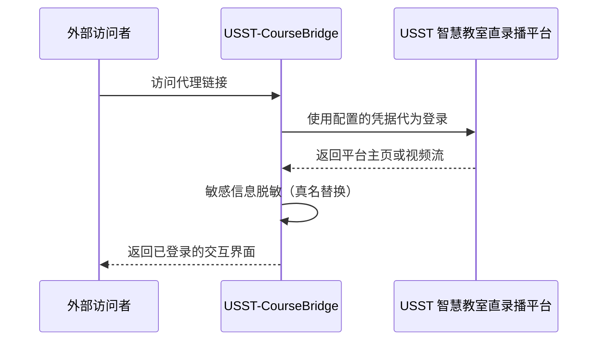

# USST 智慧教室直录播代理

## 📖 简介

本项目是专为 **上海理工大学智慧教室直录播平台** 设计的轻量级代理工具。

### 核心价值

-   **隐私保护**：无需分享账号密码，即可让同学通过代理地址观看你的课程。
-   **鉴权转发**：代理服务器代为完成平台登录并转发流媒体请求。
-   **灵活部署**：支持本地运行，可配合隧道技术实现安全公网访问。

## 🛠️ 工作原理

本项目作为中间层，在用户和平台间建立桥梁：

1. 身份托管：代理服务器持有鉴权凭据，代为完成身份认证。
2. 流量清洗：在转发页面内容时，替换真实姓名等敏感信息。
3. 透明转发：用户侧看到的链接均被重写为代理地址，确保全站浏览体验不中断。



## 🚀 快速开始

### 方式一：直接运行可执行文件（推荐）

1. **下载程序**：前往 [Releases](../../releases) 页面，下载对应操作系统的可执行文件。
2. **启动程序**：

    - **Windows**：双击运行 `usst-course-bridge-windows.exe`。
    - **macOS / Linux**：在终端执行 `./usst-course-bridge-[os]`。

3. **身份绑定**：程序启动后，根据控制台提示输入学号和密码（也可在 `.env` 文件中进行配置）。

### 方式二：通过源代码运行

1. **安装 [Deno](https://deno.land/manual/getting_started/installation)**：

    ```bash
    # Windows (PowerShell)
    irm https://deno.land/install.ps1 | iex

    # macOS / Linux
    curl -fsSL https://deno.land/x/install/install.sh | sh
    ```

2. **运行项目**：

    ```bash
    git clone https://github.com/BobLiu20/USST-CourseBridge.git
    cd USST-CourseBridge
    deno task run
    ```

## 📖 使用流程

本项目实现了开箱即用的全站透传，无需额外配置操作：

1. 启动代理：运行程序，并确认控制台提示代理启动。
2. 即刻访问：在浏览器中访问代理地址：
    - 本机：http://localhost:1906
    - 局域网：http://[计算机名].local:1906
3. 观看课程：进入后，系统已处于登录状态，可以正常查看课程、观看回放和直播，所有点击跳转都会自动保持在代理状态下。

## ⚙️ 项目配置

可通过 .env 文件进行持久化配置。

```bash
cp .env.example .env
```

| 配置项          | 说明                                                   |
| --------------- | ------------------------------------------------------ |
| `USST_USERNAME` | 统一身份认证账号（学号）。未配置时将在启动后提示输入。 |
| `USST_PASSWORD` | 统一身份认证密码。未配置时将在启动后提示输入。         |
| `USST_REALNAME` | 用于将页面中的真名替换成“USST”。未填时禁用替换功能。   |
| `HOSTNAME`      | 代理监听地址。默认为 `0.0.0.0`。                       |
| `PORT`          | 代理监听端口。默认为 `1906`。                          |

> [!TIP]
> 为避免 .env 文件泄露导致账号风险，建议优先选择在启动后通过命令行交互输入密码。

## 🌐 公网穿透

如需在校外或跨网络访问，可通过隧道技术暴露服务。

推荐使用 Cloudflare 生态：

1. **建立隧道**：使用 [Cloudflare Tunnel](https://developers.cloudflare.com/cloudflare-one/networks/connectors/cloudflare-tunnel/) 穿透内网，无需公网 IP 即可访问。
2. **访问控制**：配合 [Cloudflare Access](https://developers.cloudflare.com/cloudflare-one/identity/) 增加一层验证（如邮箱验证码，并配置邮箱白名单），只允许特定用户使用代理。

## 🛠️ 运维管理

在通过源码运行时，使用 [pm2](https://pm2.keymetrics.io/) 可以将程序作为服务，长期挂载在后台运行。

项目中已预设相关指令：

| 操作             | 指令              |
| ---------------- | ----------------- |
| **后台运行**     | `deno task start` |
| **查看实时日志** | `deno task logs`  |
| **监控资源占用** | `deno task monit` |
| **停止服务**     | `deno task stop`  |

## 🤝 贡献与反馈

如果你在安装或使用过程中遇到问题，欢迎提交 Issue。

## 📄 开源协议

本项目基于 **MIT License** 协议开源。仅供学习交流使用，请勿用于非法用途。
